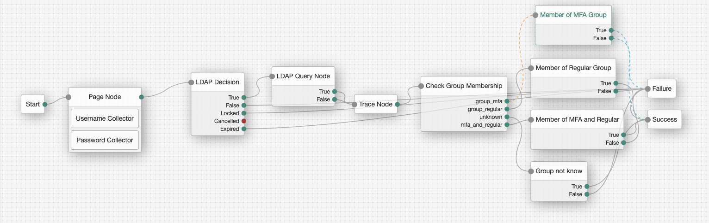

<!--
 * The contents of this file are subject to the terms of the Common Development and
 * Distribution License (the License). You may not use this file except in compliance with the
 * License.
 *
 * You can obtain a copy of the License at legal/CDDLv1.0.txt. See the License for the
 * specific language governing permission and limitations under the License.
 *
 * When distributing Covered Software, include this CDDL Header Notice in each file and include
 * the License file at legal/CDDLv1.0.txt. If applicable, add the following below the CDDL
 * Header, with the fields enclosed by brackets [] replaced by your own identifying
 * information: "Portions copyright [year] [name of copyright owner]".
 *
 * Copyright 2018 ForgeRock AS.
-->

# LdapQueryNode

An authentication node for ForgeRock's [Identity Platform][forgerock_platform] 7.4.0 and above. This node allows querying external LDAP server for additional user information. It is based on out of the box LDAP Decision Node.

### Important note
This is a "Community" node and should be used for demonstration purposes only. The code has not been tested at scale, edge cases nor passed standard ForgeRock QA process.

## Installation

Copy the .jar file from the ../target directory into the ../web-container/webapps/openam/WEB-INF/lib directory where AM is deployed. Restart the web container to pick up the new node. The node will then appear in the authentication trees components palette.

## How to use it

This node has two main functions:

- verifying if a user matching defined criterions can be found in the LDAP directory
- if found then returning additional information (attrtibutes) about the user

The node has two outcomes: **true**/**false**

- True = user matching all the criterions defined in the node was successfully found
- False = user matching all the criterions defined in the node cannot be found

Configuration for most the attributes is similar to LDAP Decision Node. Refer to the [LDAP Decision Node documentation](https://backstage.forgerock.com/docs/am/6.5/authentication-guide/#auth-node-ldap-decision) for information on how to configure the following properties:

- Primary LDAP Server
- Secondary LDAP Server
- LDAP Connection Mode
- Trust All Server Certificates
- DN to Start User Search
- Bind User DN
- Bind User Password
- Search Scope
- LDAP Connection Heartbeat Interval
- LDAP Connection Heartbeat Time Unit
- LDAP Operations Timeout

Then these properties should be configured separately (examples for default Active Directory):

- Attributes User to Search for a User: **sAMAccountName**
- Attribute Used to Retrieve User Profile: **sAMAccountName**
- User Search Filter: (for testing it can be left blank but you can add some filtering here) eg. **sn=Jensen**.
- Save selected attributes to Shared State: (if attributes configured below should be saved to Shared State) **enabled**
- Queried user object attributes to save: (attributes which will be pulled from the user object in target LDAP and saved to Shared State) - eg. **sAMAccountName, sn, memberOf**

If you follow examples given above then the outcome will be **TRUE** only if we find a user:

- residing in "DN to Start User Search" AND
- whose "username" = "Attributes User to Search for a User" AND
- matching "Search Scope" AND
- matching "User Search Filter"

If outcome is **TRUE** then **sAMAccountName, sn, memberOf** will be saved to Shared State the following way:
Key:Value
"sAMAccountName":"BJensen100",
"sn":"Jensne",
"memberOf":"cn=2FA"

After that you can start using these properties in the Tree for making other decisions. For example if "memberOf" matches "Admins" then X, else Y. See the example Tree below showing using Scriped Decision Node (membership checking - "Check Group Membership") and LDAP Query Node working together.



The script used by the "Check Group Membership":

```
var group = new String(sharedState.get("memberOf"));

if (group.match(/2fa/gi) && !group.match(/regular/gi) ) {
  outcome = "group_mfa";
} else if (group.match(/regular/gi) && !group.match(/2fa/gi)) {
  outcome = "group_regular";
} else if (group.match(/regular/gi) && group.match(/2fa/gi)) {
  outcome = "mfa_and_regular";
} else {
  outcome = "unknown";
}
```

The code in this repository has binary dependencies that live in the ForgeRock maven repository. Maven can be configured to authenticate to this repository by following the following [ForgeRock Knowledge Base Article](https://backstage.forgerock.com/knowledge/kb/article/a74096897).

The sample code described herein is provided on an "as is" basis, without warranty of any kind, to the fullest extent permitted by law. ForgeRock does not warrant or guarantee the individual success developers may have in implementing the sample code on their development platforms or in production configurations.

ForgeRock does not warrant, guarantee or make any representations regarding the use, results of use, accuracy, timeliness or completeness of any data or information relating to the sample code. ForgeRock disclaims all warranties, expressed or implied, and in particular, disclaims all warranties of merchantability, and warranties related to the code, or any service or software related thereto.

ForgeRock shall not be liable for any direct, indirect or consequential damages or costs of any type arising out of any action taken by you or others related to the sample code.

[forgerock_platform]: https://www.forgerock.com/platform/
